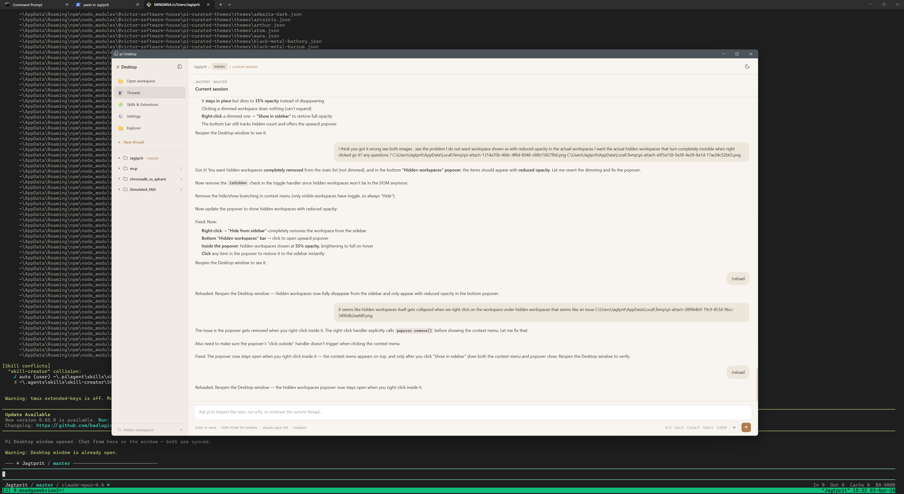
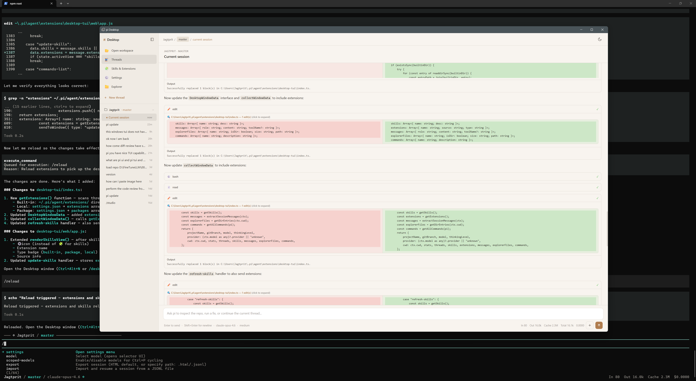

# Pi Desktop UI

A native desktop GUI for [pi](https://github.com/mariozechner/pi-coding-agent) — a fully functional chat window that mirrors your terminal session with real-time streaming, markdown rendering, and workspace management.





## Features

- **Full bidirectional chat** — send messages from the window or the terminal, both stay in sync
- **Real-time streaming** — assistant responses stream token-by-token with thinking indicators
- **Markdown rendering** with syntax-highlighted code blocks
- **Tool execution display** — see tool calls (bash, read, edit, write) with inline diffs for edits
- **Sidebar navigation:**
  - **Threads** — browse and switch between session threads
  - **Skills & Extensions** — view installed skills and loaded extensions
  - **Settings** — model info, token stats, cost tracking
  - **Explorer** — browse project files
  - **Workspaces** — navigate across all pi workspaces and their sessions
- **Slash command palette** — access all pi commands from the window
- **File attachments** — drag & drop or attach files to messages
- **Custom footer & widget** in the terminal showing project, branch, model, and token stats

## Installation

### From Git (recommended)

```bash
pi install git:github.com/pvjagtap/pi-desktop-ui
```

### Manual

Clone the repo into your pi extensions directory:

```bash
git clone https://github.com/pvjagtap/pi-desktop-ui ~/.pi/agent/extensions/pi-desktop-ui
cd ~/.pi/agent/extensions/pi-desktop-ui
npm install
```

Then reload pi:

```
/reload
```

## Usage

### Auto-open on startup

```bash
pi --desktop
```

This launches pi and automatically opens the desktop window. You can also create a shortcut using the included `pi-desktop.cmd` (Windows) or `pi-desktop.sh` (macOS/Linux) scripts.

### Open manually during a session

| Method | Action |
|--------|--------|
| `Ctrl+Alt+N` | Keyboard shortcut |
| `/desktop` | Slash command |
| `/nav` | Slash command (alias) |

The window opens alongside your terminal — type in either place. Messages, tool calls, and responses are synced in real-time.

## Security

The extension implements multiple layers of defense:

- **XSS prevention** — all markdown output is sanitized through [DOMPurify](https://github.com/cure53/DOMPurify) with a strict tag/attribute allowlist
- **Content Security Policy** — restrictive CSP blocks inline scripts from external sources, disables `connect-src`, `object-src`, and `form-action`
- **Subresource Integrity** — CDN dependencies (marked, highlight.js, DOMPurify) are loaded with `integrity` hashes to prevent tampering
- **Pinned dependencies** — all CDN scripts are pinned to exact versions
- **Path traversal protection** — file explorer, thread viewer, and workspace handlers validate that paths stay within allowed directories (cwd and `~/.pi/agent/sessions/`)
- **Attachment limits** — file uploads are capped at 25 MB with sanitized filenames
- **Input validation** — message length caps, strict shape validation on persisted config, and traversal rejection on all user-supplied paths

## Dependencies

- [glimpseui](https://github.com/nickarrow/glimpseui) — native webview windows from Node.js
- [marked](https://github.com/markedjs/marked) — markdown parsing
- [ws](https://github.com/websockets/ws) — WebSocket support

## Requirements

- [pi](https://github.com/mariozechner/pi-coding-agent) coding agent
- The [glimpse](https://github.com/nickarrow/glimpseui) skill/package must be available (provides the `glimpseui` module)

## How It Works

The extension hooks into pi's event system to capture the full agent lifecycle:

1. **`session_start`** — initializes the custom footer and context widget
2. **`message_start` / `message_update` / `message_end`** — streams assistant responses to the window
3. **`tool_execution_start` / `tool_execution_end`** — displays tool calls with arguments and results
4. **`agent_start` / `agent_end`** — shows loading states and updates token stats

User messages typed in the desktop window are sent to pi via `pi.sendUserMessage()`, and the response streams back through the same event hooks.

## Package Structure

```
pi-desktop-ui/
├── assets/
│   ├── Screenshot_1.png
│   └── Screenshot_2.png
├── web/
│   ├── index.html     # Desktop window HTML shell
│   └── app.js         # Frontend app (sidebar, chat, explorer, themes)
├── index.ts           # Extension entry point (events, commands, window management)
├── package.json       # Pi package manifest + dependencies
├── pi-desktop.cmd     # Windows launcher shortcut
├── pi-desktop.sh      # macOS/Linux launcher shortcut
└── README.md
```

## License

MIT
