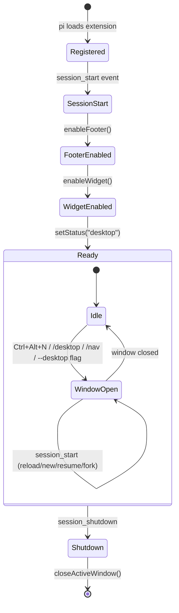
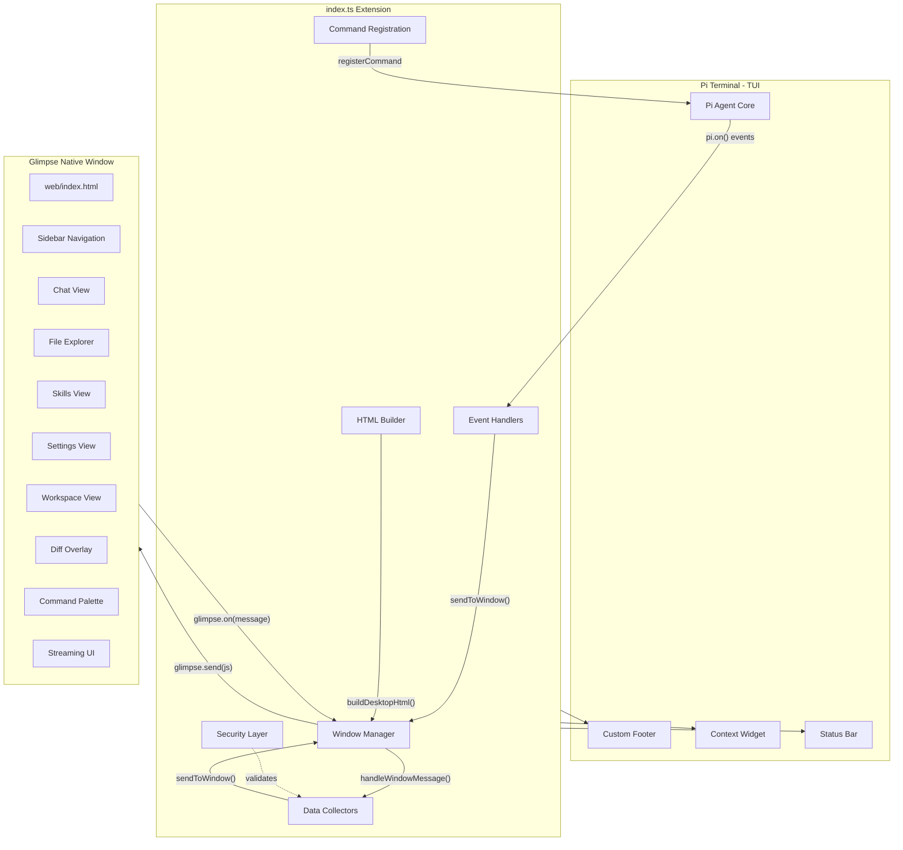
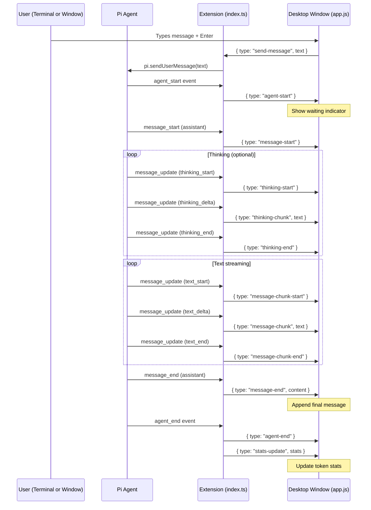
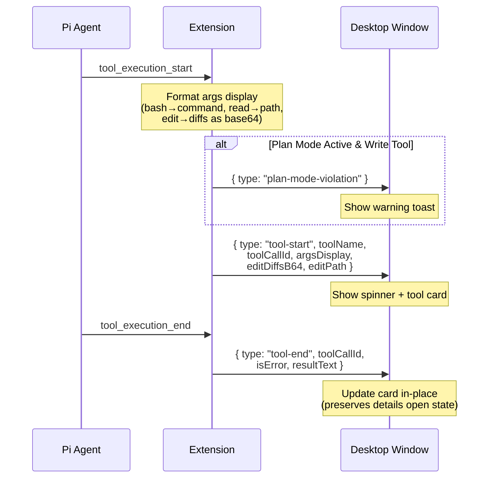
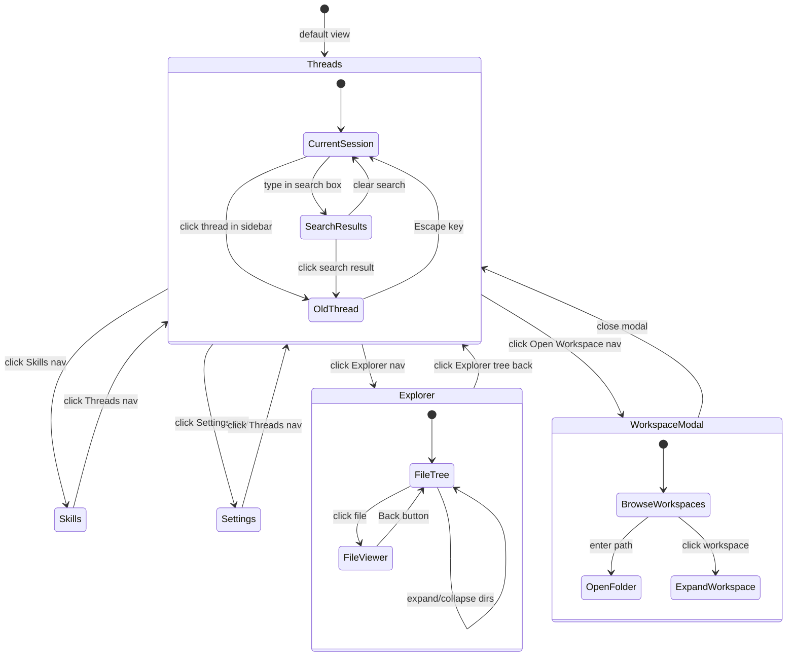
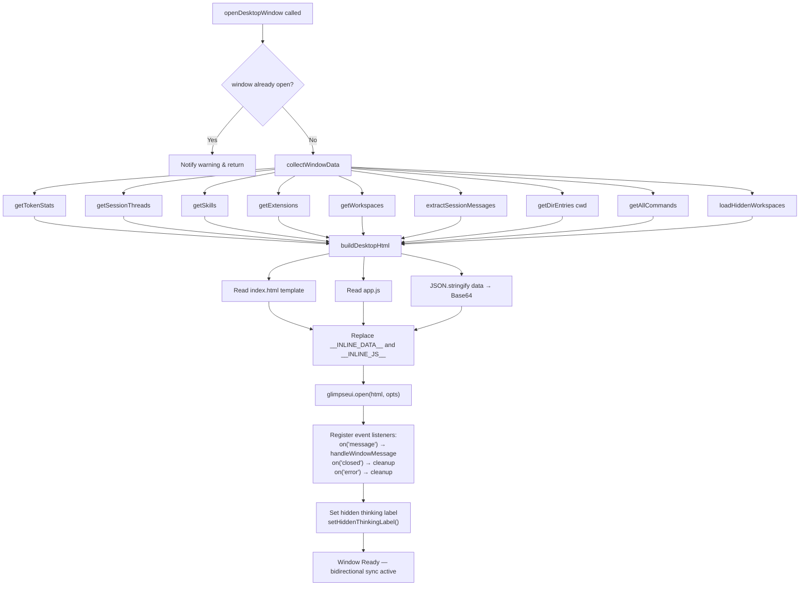
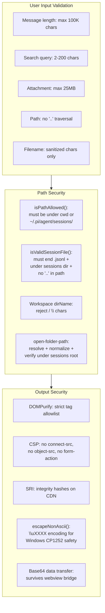

# Pi Desktop UI — Architecture Diagrams

## 1. Extension Lifecycle

## 2. High-Level Architecture

## 3. Message Streaming Flow

## 4. Tool Execution Flow

## 5. Window ↔ Extension Communication Protocol

```mermaid
graph LR
    subgraph "Window → Extension Messages"
        SM["send-message"] --> |text| A1[pi.sendUserMessage]
        OT["open-thread"] --> |file| A2[extractThreadMessages]
        NAV["nav"] --> |action| A3[getDirEntries]
        ETE["explorer-tree-expand"] --> |path| A4[getDirEntries + validate]
        EO["explorer-open"] --> |path| A5[readFile / openApp]
        GC["get-commands"] --> A6[getAllCommands]
        GS["get-stats"] --> A7[getTokenStats]
        RT["refresh-threads"] --> A8[getSessionThreads]
        RS["refresh-skills"] --> A9[getSkills + getExtensions]
        GW["get-workspaces"] --> A10[getWorkspaces]
        GWS["get-workspace-sessions"] --> A11[getWorkspaceSessions]
        ST["search-threads"] --> A12[searchSessionThreads]
        OFP["open-folder-path"] --> A13[resolve + validate path]
        SPM["set-plan-mode"] --> A14[toggle planMode]
        AF["attach-file"] --> A15[write to tmp]
        CS["cancel-streaming"] --> A16[ctx.abort]
        SHW["set-hidden-workspaces"] --> A17[saveHiddenWorkspaces]
        CL["close"] --> A18[closeActiveWindow]
    end
```

```mermaid
graph LR
    subgraph "Extension → Window Messages"
        B1["agent-start / agent-end"]
        B2["message-start / chunk / end"]
        B3["thinking-start / chunk / end"]
        B4["tool-start / tool-end"]
        B5["stats-update"]
        B6["thread-messages"]
        B7["explorer-data / tree-children"]
        B8["file-content"]
        B9["commands-list"]
        B10["update-threads / update-skills"]
        B11["workspaces-list / workspace-sessions"]
        B12["search-results"]
        B13["workspace-opened"]
        B14["file-attached-ack"]
        B15["plan-mode-violation"]
        B16["session-changed"]
        B17["provider-request"]
    end
```

## 6. Sidebar Navigation State Machine

## 7. Data Flow on Window Open

## 8. Security Model

